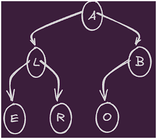
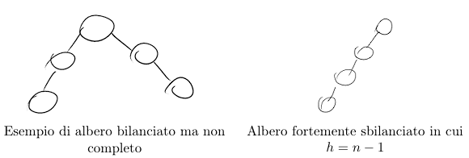
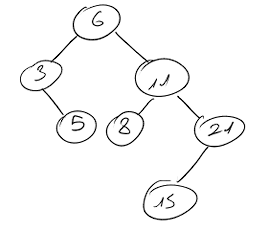

# Alberi - Modulo 1

## Descrizione
Questa sezione copre la teoria e l'implementazione in C++ riguardante gli **alberi** (capitoli 8-13).

## Struttura della Cartella

```text
Alberi/
├── main.cpp              # File principale con test generici
├── alberiBinari.h        # Header con implementazione Alberi Binari
└── README.md             # Questo file
```

## Architettura

### File Header (`.h`)
Ogni tipologia di albero è **completamente implementata in un file header dedicato**:
- Dichiarazioni delle classi
- Implementazioni dei metodi (inline)
- Strutture dati interne

### `main.cpp`
Contiene:
- L'inclusione di tutti gli header degli alberi
- Funzioni di test generiche
- Esecuzione dei test per ogni tipo di albero

## Compilazione
La compilazione è gestita da **CMake** tramite il file `CMakeLists.txt`. Il compilatore include automaticamente tutti gli header utilizzati nel `main.cpp`.

---

# Teoria degli Alberi

Un **albero radicato** è una coppia $T = (N, A)$ dove:
- $N$ è un insieme finito di nodi fra cui si distingue un nodo $r$ detto **radice**.
- $A \subseteq N \times N$ è un insieme di coppie di nodi, detti **archi**.

In un albero, ogni nodo $v$ (eccetto la radice) ha esattamente un genitore (o padre) $u$ tale che esiste un arco $(u, v) \in A$.

## Definizioni Principali

- Un nodo può avere 0 o più figli.
- Il numero di figli di un nodo è detto **grado**.
- Un nodo senza figli è detto **foglia**.
- Un nodo che non è una foglia è detto **nodo interno**.
- Due nodi con lo stesso padre sono detti **fratelli**.

### Lunghezza e Relazioni
- **Lunghezza del cammino**: Numero di archi del cammino, oppure numero di nodi che formano il cammino meno 1.
  > *Nota: Esiste sempre un cammino di lunghezza 0 da un nodo a sé stesso ($u \to u$).*

- **Discendente**: Dato un albero radicato $T$ e presi due nodi $x$ e $y$, si dice che "$x$ è discendente di $y$" se e solo se $x$ è figlio diretto o indiretto di $y$.
  - Tracciando il cammino da $y$ ad una foglia, deve essere presente $x$.
  - Ogni nodo è discendente di sé stesso.

- **Antenato**: Dato un albero radicato $T$ e presi due nodi $x$ e $y$, si dice che "$y$ è antenato di $x$" se e solo se $x$ è discendente di $y$.
  - Esiste un cammino (che scende verso il basso) che parte da $y$ e arriva a $x$.
  - Ogni nodo è antenato di sé stesso.
  > Se $y$ è un antenato di $x$ e $x \neq y$, allora $y$ è un **antenato proprio** di $x$, e $x$ è un **discendente proprio** di $y$.

### Profondità, Livello e Altezza
- Il **sottoalbero** con radice in $x$ è l’albero indotto dai discendenti di $x$.
- La **profondità** di un nodo $x$ è la lunghezza del cammino dalla radice a $x$.
- Un **livello** di un albero è costituito da tutti i nodi che si trovano alla stessa profondità.
- L’**altezza di un nodo** $x$ è la lunghezza del più lungo cammino che scende dal nodo $x$ a una foglia.
- L'**altezza di un albero** è l'altezza della sua radice, calcolabile anche come la profondità massima tra tutti i nodi dell'albero.

---

## Rappresentazione in Memoria (Paragrafi 9.3 / 9.4)

Esistono due metodi principali per rappresentare la struttura dati "Albero" nella memoria del computer:
1. **Tramite Array**
2. **Tramite Puntatori**

I capitoli mostrano matematicamente il costo di operazioni comuni come:
- `padre(Tree P, Node v) → Node U {NIL}`
- `figli(Tree P, Node v) → List of Node`

**Sintesi della scelta implementativa:**
- Per un albero con un numero di figli fisso (es. albero binario), si usano i **normali puntatori** ai figli.
- Per un albero con un numero di figli variabile e imprevedibile, la rappresentazione **"Figlio sinistro - Fratello destro"** è in assoluto l'approccio migliore e più elegante.
- Gli **array** vengono utilizzati quasi esclusivamente per strutture molto specifiche, come ad esempio gli Heap.

---

## Alberi Binari (`alberiBinari.h`)

Gli alberi binari sono un caso speciale degli alberi k-ari dove $k = 2$.
> *Nota: Un albero vuoto è un albero binario (spesso utilizzato come caso base).*

**Albero Completo vs Albero Bilanciato:**
- Un **albero k-ario completo** è tale quando:
  - Tutte le foglie hanno la stessa profondità.
  - Tutti i nodi interni hanno esattamente grado $k$ (esattamente $k$ figli).

---
# Algoritmi di Visita

Gli algoritmi di visita permettono di esplorare l'albero. Il tempo di esecuzione per la visita dell'intero albero è $O(n)$, poiché ogni nodo viene visitato una sola volta.

Esistono due macro-categorie (illustrate in [`algoritmiDiVista.h`](algoritmiDiVista.h)):

## 1. Visita DFS (Depth-First Search - Visita in profondità)
Esplora i rami il più in profondità possibile prima di tornare indietro. Può essere implementata con una struttura dati **Stack** (politica LIFO) o tramite **ricorsione**.



Per questa tipologia di vista abbiamo tre possibili ordini di esplorazione ricorsiva (riferimento all'immagine sopra):

1. **Pre-ordine (Anticipata)**: Visita Radice $\to$ Figlio Sinistro $\to$ Figlio Destro.
   - *Esempio: A L E R B O*
2. **Simmetrica (In-order)**: Visita Figlio Sinistro $\to$ Radice $\to$ Figlio Destro. **(Cruciale per i BST)**.
   - *Esempio: E L R A O B*
3. **Post-ordine (Posticipata)**: Visita Figlio Sinistro $\to$ Figlio Destro $\to$ Radice.
   - *Esempio: E R L O B A*

## 2. Visita BFS (Breadth-First Search - Visita in ampiezza)
Visita tutti i nodi di una determinata profondità prima di scendere al livello successivo. Utilizza una struttura dati **Queue** (politica FIFO).

> **Riassunto:** La visita DFS si differenzia in pre-order, in-order e post-order in base al momento in cui viene processato il nodo radice. BFS e DFS differiscono principalmente per la strategia e la struttura dati utilizzata (Queue per BFS, Stack/Ricorsione per DFS).

---

# Alberi Binari di Ricerca (BST)

Prima d'introdurre i BST, è essenziale definire quando un albero si dice completo e bilanciato.

- **Albero quasi completo (o semplicemente completo in alcuni contesti)**: Quando tutti i livelli, tranne al limite l’ultimo, sono completamente riempiti, e tutti i nodi dell’ultimo livello sono spinti il più a sinistra possibile.
- **Albero bilanciato**: Un albero binario è bilanciato se l'altezza $h = O(\log n)$.
  > Un albero completo è di conseguenza un albero bilanciato, ma un albero bilanciato non è necessariamente completo.



### Definizione di BST
Un **Albero Binario di Ricerca** è un albero che soddisfa la seguente **Proprietà di ricerca**:
- Sia $x$ un nodo dell'albero.
- Se $y$ è un nodo nel **sottoalbero sinistro** di $x$, allora `y.Key <= x.Key`.
- Se $y$ è un nodo nel **sottoalbero destro** di $x$, allora `y.Key >= x.Key`.



Si noti che tramite l'[algoritmo di ricerca (`tree_serch`)](alberiBinariDiRicerca.h) possiamo tagliare lo spazio di ricerca dato che la proprietà base degli alberi di ricerca, infatti,
a ogni iterazione escludiamo un sottoalbero sx o dx dipendentemente dal valore cercato.
Questo permette di avere una complessità data dal cammino per raggiungere tale nodo, dunque pari a O(h), inoltre: 
- Se l’albero è bilanciato allora T(n) = O(logn).
- Se l’albero è fortemente sbilanciato (caso "catena"), T(n) = O(n).

La presenza del logaritmo indica proprio i nodi che stiamo andando a eliminare scendendo a dx o sx

---

Invece algoritmi per la [ricerca del massimo e del minimo (`tree_max & tree_min`)](alberiBinariDiRicerca.h)  sfruttano sempre la struttura del nosto albero binario di ricerca, infatti,
per loro natura sappiamo che il minimo dell'albero è l'elemento più a sx, mentre il più a dx è il massimo
