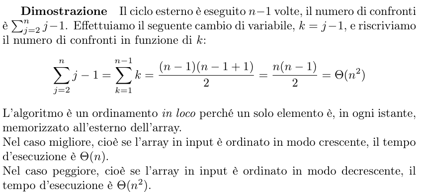
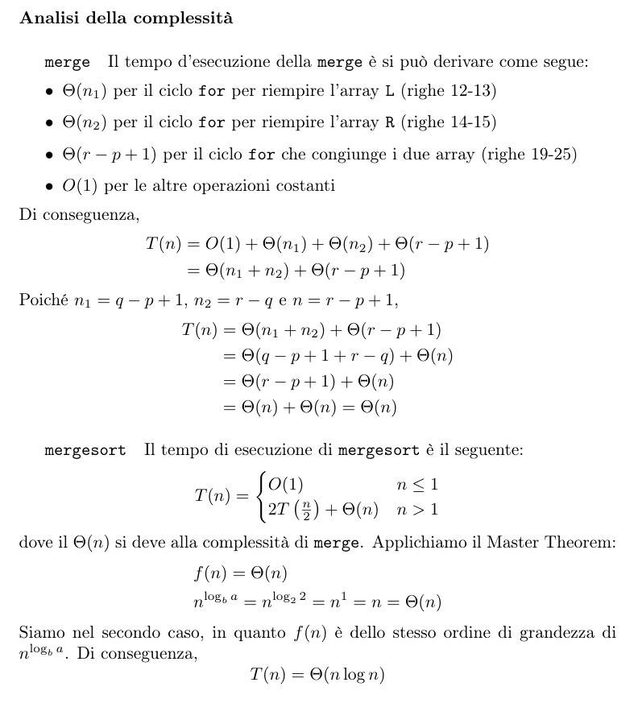

## Algoritmi di ordinamento yaaa

### [INSERTION SORT](insertionSort.h)

L'**Insertion Sort** è un algoritmo di ordinamento semplice ed intuitivo. Basa il suo funzionamento su un invariante fondamentale: ad ogni iterazione, la parte sinistra dell'array risulta sempre ordinata.

### Funzionamento
Dato un array, partiamo dal suo secondo elemento (assumendo che il sottoarray formato solo dal primo elemento sia già ordinato). Questo elemento diventa la nostra "chiave".
Andiamo poi a confrontare la chiave con tutti gli elementi della parte ordinata (alla sua sinistra), scorrendo all'indietro:
- Se troviamo un elemento più grande della chiave, lo "shiftiamo" verso destra di una posizione.
- Il ciclo si ferma quando troviamo un elemento minore o uguale alla chiave, oppure quando raggiungiamo l'inizio dell'array.
A quel punto, inseriamo la chiave nella posizione liberata. Terminato questo processo, la porzione ordinata dell'array sarà cresciuta di un elemento.

L'**invariante di ciclo** garantisce la correttezza dell'algoritmo: al passo *j*, il sottoarray da `A[0]` a `A[j-1]` è formato dagli stessi elementi che c'erano originariamente, ma ora sono ordinati. Alla fine del ciclo, con *j* pari alla lunghezza dell'array, l'intero array risulta ordinato.

### Proprietà, Vantaggi e Svantaggi

**Vantaggi:**
- **Ordinamento in loco (in-place):** Richiede solo una quantità di memoria extra costante (la variabile che contiene la chiave), poiché modifica i dati direttamente all'interno dell'array originario.
- **Stabile:** Elementi con lo stesso valore mantengono l'ordine relativo che avevano nell'array di partenza.
- **Sensibile all'input (Adattivo):** Se l'algoritmo incontra un elemento che è già maggiore di tutto il sottoarray ordinato a sinistra, il ciclo interno (while) termina immediatamente o non parte affatto, rendendolo estremamente efficiente su array parzialmente ordinati.

**Svantaggi:**
- **Ineofficiente su grandi moli di dati:** L'algoritmo scala male. A causa della potenziale necessità di shiftare tutti gli elementi ad ogni inserimento, nel caso medio la complessità esplode.

### Complessità

- **Caso Migliore:** $O(n)$ — Si verifica quando l'array è già ordinato. Il ciclo interno non esegue mai shift.
- **Caso Peggiore:** $O(n^2)$ — Si verifica quando l'array è ordinato al contrario (decrescente). Ad ogni iterazione la chiave deve essere confrontata fino all'inizio dell'array, shiftando ogni elemento.
- **Caso Medio:** $O(n^2)$
---

**Best Practices:**
Date le sue caratteristiche, l'Insertion Sort non si presta per dataset massicci, per i quali si preferiscono Merge Sort o Quick Sort. Tuttavia, dati i suoi bassissimi overhead e il comportamento adattivo, **viene spesso usato come algoritmo ausiliario all'interno di algoritmi più complessi** per ordinare array (o partizioni di array) di piccolissime dimensioni in modo rapidissimo.
---

### [MERGE SORT](mergeSort.h)

Il **Merge Sort** è un efficiente algoritmo di ordinamento basato sul paradigma algoritmico del **Dividi et Impera**.

### Funzionamento 
1. **Dividi:** Spezza l'array a metà ricorsivamente, fino ad arrivare a sottoarray costituiti da un singolo elemento.
2. **Impera (Caso base):** Un array di un solo elemento è, per definizione, già ordinato.
3. **Combina (Merge):** Fonde (unisce) due sottoarray già ordinati per produrre un unico array ordinato più grande, fino a ricostruire l'intero array iniziale.

### Proprietà, Vantaggi e Svantaggi

**Vantaggi:**
- **Complessità garantita:** Il tempo di esecuzione è sempre $O(n \log n)$ a prescindere dall'ordinamento iniziale dell'input (il caso migliore, medio e peggiore coincidono asintoticamente). Questo lo rende eccellente per moli di dati considerevoli.
- **Stabile:** Gli elementi con lo stesso valore mantengono l'ordine relativo che avevano nell'array di partenza.

**Svantaggi:**
- **Non è in loco (Not in-place):** Per effettuare la combinazione (merge) richiede uno spazio in memoria aggiuntivo proporzionale alla dimensione dell'array, portando la complessità spaziale a $O(n)$.
- **Non adattivo:** Di base, l'algoritmo esegue ciecamente tutte le suddivisioni e fusioni anche se l'array (o una sua parte) è già completamente ordinato.

### Possibili Miglioramenti
Un'ottimizzazione molto comune (sfruttata da algoritmi ibridi come il Timsort) prevede di usare una funzione wrapper: invece di spingere la ricorsione fino ad ottenere sottoarray di lunghezza 1, quando si raggiungono porzioni di dimensione molto piccola (tipicamente tra i 5 e i 25 elementi), conviene bloccare il Merge Sort e utilizzare l'**Insertion Sort** su quell'ultimo frammento. Su array molto piccoli, l'Insertion Sort vince a mani basse in quanto ha meno "overhead" da gestire (nessuna chiamata ricorsiva né allocazione di vettori extra).

### Complessità

- **Caso Migliore:** $O(n \log n)$
- **Caso Peggiore:** $O(n \log n)$
- **Caso Medio:** $O(n \log n)$

---
**Merge Sort vs Insertion Sort:**
Confrontando il grafico delle curve asintotiche, ci si rende conto che l'**Insertion Sort** risulta più efficace solamente per input ridotti o per array quasi totalmente ordinati (dove performa a $O(n)$). Al crescere del tasso di dati (e specialmente con distribuzioni decrescenti) degenera drasticamente in una curva quadratica $O(n^2)$.
Al contrario, il **Merge Sort** offre una sicurezza granitica: i tempi tendono "al più" a una complessità di $O(n \log n)$, rendendolo obbligatorio quando bisogna gestire dataset massivi, al costo di un approccio meno performante dal punto di vista dello spazio occupato in memoria.
